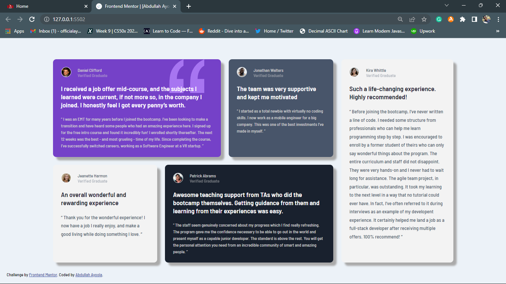

# Frontend Mentor - Testimonials grid section solution

This is a solution to the [Testimonials grid section challenge on Frontend Mentor](https://www.frontendmentor.io/challenges/testimonials-grid-section-Nnw6J7Un7). Frontend Mentor challenges help you improve your coding skills by building realistic projects.

## Table of contents

- [Overview](#overview)
  - [The challenge](#the-challenge)
  - [Screenshot](#screenshot)
  - [Links](#links)
- [My process](#my-process)
  - [Built with](#built-with)
- [Author](#author)

## Overview

### The challenge

Users should be able to:

- View the optimal layout for the site depending on their device's screen size

### Screenshot

### Links

- Solution URL: [solution URL here](https://your-solution-url.com)
- Live Site URL: [live site URL here](https://your-live-site-url.com)

## My process

Desktop-first workflow

### Built with

- Semantic HTML5 markup
- CSS custom properties
- Flexbox
- CSS Grid
- Desktop-first workflow

## Author

- Website - [Abdullah Ayoola](https://www.your-site.com)
- Frontend Mentor - [@abdullah43577](https://www.frontendmentor.io/profile/abdullah43577)
- Twitter - [@officialayo540](https://twitter.com/officialayo540)
